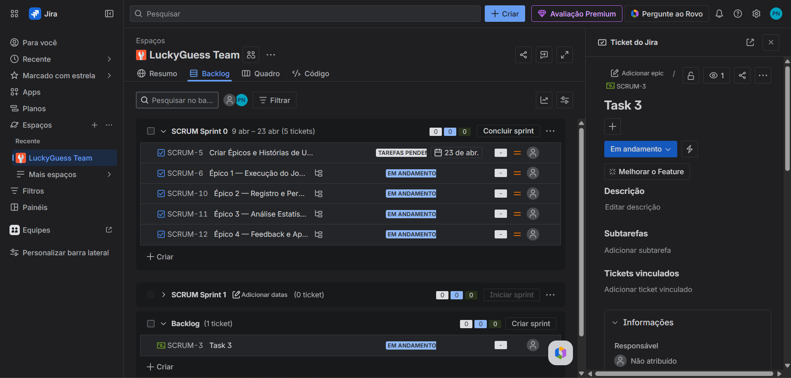

### A equipe
|Nome|Perfil do Github|
|---|---|
|Abraão Filipi dos Santos -- DEV |[@abraaosantosdeveloper](https://github.com/abraaosantosdeveloper/)||
|Pedro Pessoa -- DEV |[@pedropessoa](https://github.com/Ppan-droid)||
|Dilvanir Aline -- DESIGNER |[@aline](https://github.com/daacm-cele)|||
|Emanoel Alessandro -- DEV |[@emanoel](https://github.com/emanoel0106)||
|Marcio Aureliano -- TECH LEAD |[@marcio]()||
|Maria Larysse -- PO |[@larysse]()||
---
### Funcionamento do jogo

A princípio, a aplicação deve sortear um número e o jogador deve advinhá-lo. Se não conseguir, o jogador terá que responder perguntas para receber pistas sobre seu chute, como por exemplo, se o seu palpite está acima ou abaixo do número sorteado. 

Se o jogador acertar de primeira, obtém a pontuação máxima, e poderá adicionar uma pergunta ao jogo. 

Caso não acerte de primeira, o jogador poderá responder perguntas de conhecimentos gerais, podendo acumular um streak de perguntas corretas, e tendo a opção de pular a pergunta, caso não saiba a resposta. Assim, não perderá o streak acumulado.

Haverá um multiplicador de pontos, que será reduzido de **5x** até **1x** a cada 5 segundos. Cada pergunta vale **200 pts**, podendo ser multiplicados pergunta a pergunta até atingir a pontuação máxima de **10.000 pts**. 

Ao atingir a pontuação máxima, o jogo se encerra e o jogador adiciona sua pergunta ao jogo.

## Informações técnicas

##### Linguagem de programação utilizada
O jogo utiliza a linguagem de programação C, por ocasião da disciplina de **Programação imperativa e Funcional**, bem como por seu desempenho e controle total de utilização de recursos, tornando-a uma biblioteca extremamente versátil e que consome recursos mínimos de processamento, mantendo um padrão de execução excepcional.

##### Bibliotecas externas
O programa utiliza a biblioteca externa **TextUtils**, desenvolvida pelo discente Abraão F. Dos Santos, inicialmente em python, e portada para a linguagem C.

**Link do repositório:** 
Para acessar a biblioteca utilizada e implementá-la em seus projetos, basta clicar no link: [Text Utils Library](https://github.com/abraaosantosdeveloper/text-utils-c-edition/)

**Nota ao usuário:**

>*O repositório original possui termos de uso descritos no arquivo **LICENSE**. Leia-o com atenção antes de utilizar a biblioteca.*

## Product Backlog - Jira's Board



   

## Como compilar

Recomendado:
```bash
gcc -std=c11 -Wall -Wextra -o luckyguess.exe *.c
```

Alternativa (lista explicita de arquivos):
```bash
gcc -std=c11 -Wall -Wextra -o luckyguess.exe main.c ui_menu.c jogo.c analise.c historico.c perguntas.c sorteio.c text_utils.c
```

