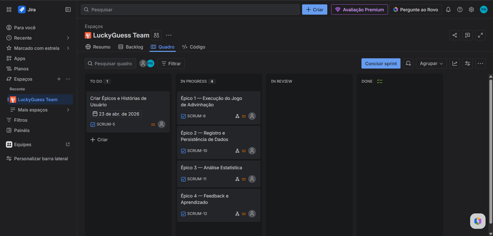

### A equipe
|Nome|Perfil do Github|
|---|---|
|Abraão Filipi dos Santos -- DEV |[@abraaosantosdeveloper](https://github.com/abraaosantosdeveloper/)||
|Pedro Pessoa -- DEV |[@pedropessoa](https://github.com/Ppan-droid)||
|Dilvanir Aline -- DESIGNER DE ARTE |[@aline](https://github.com/daacm-cele)|||
|Emanoel Alessandro -- AUDIO-VISUAL E COMUNICAÇÃO|[@emanoel0106](https://github.com/emanoel0106)||
|Marcio Aureliano -- DESIGNER DE INTERFACE |[@marcio]()||
|Maria Larysse -- PO |[@mlylp](https://github.com/mlylp)||

## Equipe e Contribuições

---

**Maria Larysse — Líder de Projeto / Product Owner**
- Liderança geral da equipe e coordenação das atividades do projeto
- Elaboração das histórias de usuário (User Stories), definindo requisitos e critérios de aceitação
- Esclarecimento e alinhamento das histórias de usuário com a equipe de desenvolvimento
- Facilitação da comunicação entre os membros, garantindo o entendimento compartilhado das funcionalidades
- Priorização do backlog e acompanhamento do progresso das entregas

---

**Aline — Designer de Arte / Pixel Artist**
- Criação das artes do jogo em pixel art, desenvolvendo a identidade visual do Paramancer
- Design de personagens, cenários e elementos visuais do jogo
- Produção de assets gráficos utilizados na implementação do jogo
- Participação nas reuniões de equipe, contribuindo com a proposta criativa e visual do projeto

---

**Abraão — Desenvolvedor**
- Integração e configuração da biblioteca Raylib ao projeto, estabelecendo a base gráfica do Paramancer
- Implementação dos sistemas de renderização e gerenciamento de janela, inputs e recursos visuais via Raylib em C
- Desenvolvimento de componentes centrais da arquitetura do jogo em linguagem C
- Colaboração com Pedro na integração dos demais módulos do sistema
- Participação nas reuniões de equipe e tomada de decisões técnicas

---

**Pedro — Desenvolvedor**
- Desenvolvimento do loop principal do jogo (game loop), controlando o fluxo de atualização e renderização de frames
- Implementação da lógica de estados do jogo e gerenciamento do ciclo de execução em linguagem C
- Integração do game loop com os demais componentes desenvolvidos pela equipe
- Participação nas reuniões de equipe e contribuição nas decisões técnicas

---

**Márcio — Designer de Interface (UI/UX)**
- Criação do protótipo de telas do jogo utilizando Figma, definindo a experiência visual e de navegação
- Contribuição na estruturação da proposta e conceito do jogo Paramancer
- Alinhamento visual entre arte e interface junto à Aline
- Participação ativa em todas as reuniões de equipe

---

**Emanuel — Audiovisual e Documentação**
- Produção e apresentação do vídeo de demonstração do projeto, detalhando as funcionalidades do Paramancer
- Curadoria e seleção da trilha sonora do jogo, avaliando e definindo as músicas integradas ao Paramancer
- Contribuição na estruturação da proposta criativa e conceitual do jogo
- Participação ativa em todas as reuniões de equipe

# Sobre o Jogo
---
## Protagonista: Dex

## Antagonista: The Entity

### História
Dex é um jovem que ama matemática e estatística, e ele tem um dom extraordinário: enxergar padrões matemáticos em tudo. Dex começa a perceber
falhas no seu mundo: como se a “matrix” estivesse corrompida. Ele descobre que há uma Entidade corruptora, uma IA que rouba parâmetros do universo e, por
isso, as falhas na “matrix” começaram a aparecer. Seu trabalho, é adivinhar estes parâmetros e devolvê-los à “matrix”, o que enfraquecerá a Entidade e restaurará a
estabilidade do seu universo.

## Fluxo do jogo
A cada rodada, um número aleatório é gerado, e o jogador tem a chance de acertá-lo para ganhar o jogo. Caso nao obtenha sucesso, ele recebe uma pergunta com opçoes de respostas. Se acertar a pergunta, o jogador causa dano ao oponente e recebe uma dica em relaçao ao número gerado pelo sistema que ele está buscando acertar. Caso ele erre a pergunta feita, o personagem protagonista recebe dano, e o jogador ganha mais uma chance de acertar o número alvo, mas sem receber dicas sobre ele.

### Mecânicas adjacentes
> Isto é apenas um conceito; as imagens serão melhoradas.

### Buffers
**Buffer de Hp extra**

Ao receber, o usuário ganhará uma determinada quantidade de corações extras.

**Buffer de Dano crítico**

Com este buffer, o usuário dará o dobro de dano ao inimigo.

**Buffer de Imunidade**

Com este buffer, ao errar uma pergunta caso o personagem não acerte o número (parâmetro) a ser advinhado, ele não perderá vida.

## Informações técnicas

##### Linguagem de programação utilizada
O jogo utiliza a linguagem de programação C, por ocasião da disciplina de **Programação imperativa e Funcional**, bem como por seu desempenho e controle total de utilização de recursos, tornando-a uma biblioteca extremamente versátil e que consome recursos mínimos de processamento, mantendo um padrão de execução excepcional.

##### Bibliotecas externas
O programa utiliza a biblioteca externa **Raylib** para criação da interface.

## Product Backlog - Jira's Board

   

## Histórias do Usuário 
---

### Iniciar Partida
Eu, como jogador, quero iniciar uma partida com um número aleatório oculto, para tentar acertar e testar minha capacidade de adivinhação.

---

### Feedback de Palpite
Eu, como jogador, quero receber feedback se meu palpite está alto ou baixo, para ajustar minha estratégia.

---

### Tentativas Contínuas
Eu, como jogador, quero continuar tentando até acertar o número, para completar o desafio.

---

### Visualizar Pontos de Vida
Eu, como jogador, quero visualizar os pontos de vida restantes meu e do meu adversário.

---

### Tutorial e História do Jogo
Eu, como jogador, quero receber informações sobre como jogar e entender a história que envolve o jogo.

---

### Perguntas e Dicas
Eu, como jogador, quero responder a perguntas curiosas e contextualizadas para desafiar meu nível de conhecimento e conseguir ganhar uma dica sobre meu palpite de número.

---

### Revelar Resposta Correta
Eu, como jogador, quero ser capaz de visualizar qual a resposta correta da pergunta quando eu errar, para que eu possa aprender.

---

### Estatísticas da Sessão
Eu, como jogador, quero ter acesso aos meus dados de média, melhor/pior sessão, desvio, recursão em soma/mín/máx/soma quadrados.

---

### Reiniciar ou Sair da Partida
Eu, como jogador, quero ser capaz de continuar jogando quantas vezes eu quiser, ou sair da partida em qualquer momento.

### Em breve, mais conteúdo
> Fique atento às atualizações futuras.
